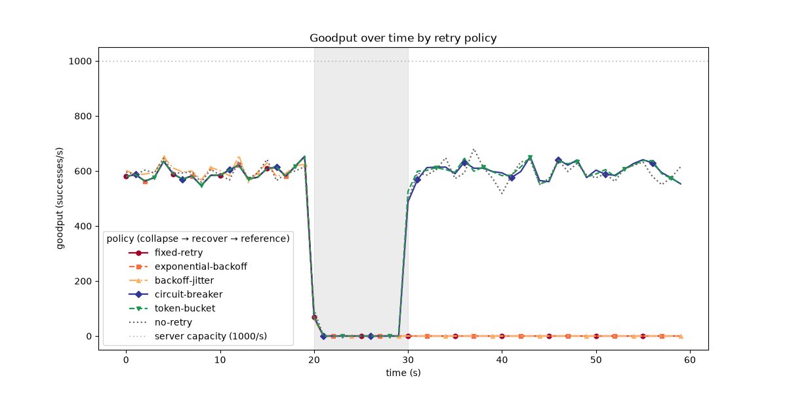
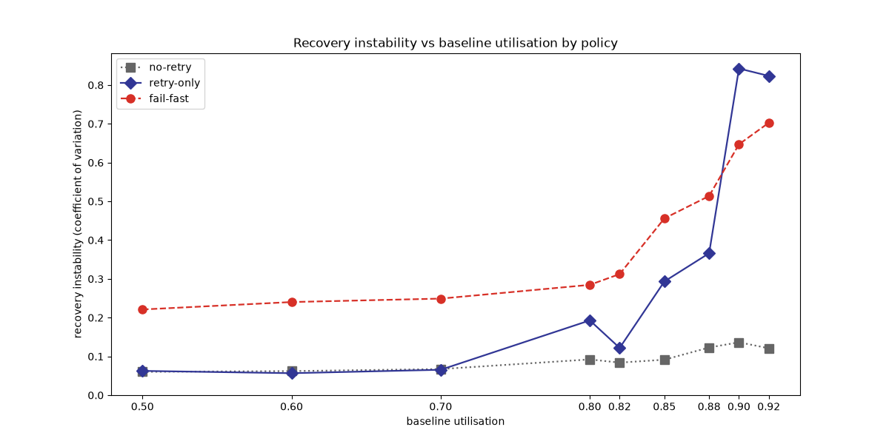
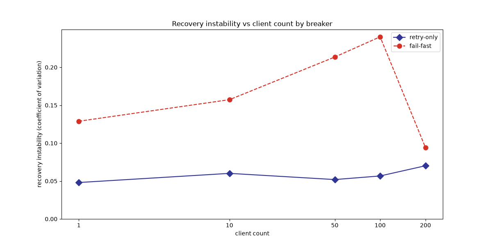

# retrystorm

A discrete-event simulation of retry storms: how retries, backoff, jitter, token buckets and circuit breakers change the way a system recovers from overload.

## Why

A short overload makes some requests fail. Clients retry them, and those retries pile on top of the load that caused the failure.

So the system can stay down long after the original trigger is gone. It has two stable states, healthy and collapsed, and a brief shock is enough to push it into the second one. Usually the only way out is to shed load by hand.

This is called metastable failure. Background reading:

- Marc Brooker's blog: https://brooker.co.za/blog/
- "Metastable Failures in Distributed Systems", HotOS'21: https://sigops.org/s/conferences/hotos/2021/papers/hotos21-s11-bronson.pdf

## What it simulates

Clients and a server are generic. Nothing in the model is tied to a specific domain.

The server has a fixed number of workers and a bounded queue, and rejects new work once the queue is full. Each client sends requests as a Poisson process, puts a timeout on every attempt, and on failure consults its retry policy, up to a hard attempt cap. The experiments point many clients at one server (fan-in). Scenarios are written in code, not a config file.

Each run records goodput, offered load, queue depth and p99 latency per second. That is what makes the policies comparable under the same overload.

## Results

The canonical experiment holds capacity, queue bound and load fixed and swaps one retry policy at a time. A ten-second arrival spike at t=20–30s triggers the storm; the run continues to t=60s.



Every policy loses goodput during the spike (shaded). After it lifts, three stay collapsed at zero — fixed retry, exponential backoff, and backoff with jitter — while no-retry, the token bucket and the circuit breaker recover. Backoff and jitter alone do not prevent the collapse at this load; only capping the *volume* of retries does.

Two boundaries qualify that headline.



A circuit breaker helps only at moderate utilisation. As the baseline load approaches capacity it grows unstable, and by 0.9 it depresses the baseline goodput that no-retry still carries (`docs/phase_collapse.png`). At 0.9 the breakers trip in steady state, before any overload exists.



Splitting one breaker into many independent per-client breakers makes a fail-fast breaker less stable in recovery as the count rises, while a retry-only breaker stays steady.

The client-count sweep (`results/sweep.csv`) shows the matching boundary for backoff: it recovers with few clients and collapses with many. Latency over time is in `docs/p99_over_time.png`; the recovery-window p99 spikes come from the ~1% of requests that succeed on a retry.

Every chart is reproducible from the commands in [EXPERIMENTS.md](EXPERIMENTS.md).

## Retry policies

- **No retry** — the baseline.
- **Fixed retry** — retry N times, same delay every time.
- **Exponential backoff** — the delay doubles on each attempt.
- **Backoff with jitter** — random delay, so clients stop retrying in lockstep.
- **Token bucket** — a retry budget that runs out if failures keep coming.
- **Circuit breaker** — stop retrying after too many failures, then probe to see if it is safe again.

## Layout

- `sim/` — the Java 21 simulation (Gradle project)
- `plots/` — Python plotting scripts
- `results/` — CSV output, git-ignored
- `docs/` — rendered charts

## Running

The simulation writes CSVs into `results/`. The first argument picks the mode; `canonical` is the default:

```bash
cd sim && ./gradlew run                            # per-policy time series + combined.csv
cd sim && ./gradlew run --args="validate"          # collapse vs recovery across 5 seeds
cd sim && ./gradlew run --args="sweep"             # backoff vs token bucket by client count
cd sim && ./gradlew run --args="herd"              # one breaker split into many per-client breakers
cd sim && ./gradlew run --args="phase"             # breaker behaviour across baseline utilisation
cd sim && ./gradlew run --args="analyze-spikes"    # recovery p99 split by attempt count
cd sim && ./gradlew run --args="analyze-breaker-state"  # baseline breaker tripping by utilisation
```

Parameters and output columns for each mode are documented in [EXPERIMENTS.md](EXPERIMENTS.md).

Tests:

```bash
cd sim && ./gradlew test
```

Charts render from the CSVs into `docs/`. Install the dependencies, then run the subcommand for the CSV you produced:

```bash
cd plots
pip install -r requirements.txt
python plot_results.py canonical   # goodput_over_time.png, p99_over_time.png
python plot_results.py herd        # herd_instability.png
python plot_results.py phase       # phase_instability.png, phase_collapse.png
```
